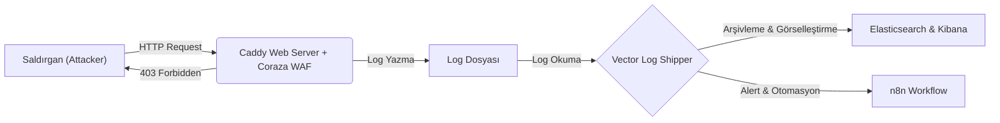

# 🛡️ DevSecOps SOAR Pipeline: WAF, Vector, Elastic & n8n

   

Bu proje, modern bir **DevSecOps** mimarisi kullanarak; web saldırılarını engelleyen, logları analiz eden ve olay müdahale (Incident Response) süreçlerini otomatize eden konteyner tabanlı bir güvenlik laboratuvarıdır.

## 🏗️ Mimari ve Veri Akışı

1-Koruma (Prevention): Caddy sunucusu üzerinde çalışan Coraza WAF (OWASP Core Rule Set), gelen SQLi/XSS saldırılarını engeller.

2-Toplama (Collection): Vector, WAF loglarını gerçek zamanlı okur ve JSON formatına çevirir.

3-Analiz (Analysis): Loglar Elasticsearch'e gönderilir ve Kibana üzerinde görselleştirilir.

4-Otomasyon (Response): Kritik alarmlar n8n'e iletilir ve E-posta/Slack bildirimi oluşturulur.

🚀 Kurulum (Quick Start)
Bu projeyi kendi bilgisayarınızda çalıştırmak için Docker ve Docker Compose yüklü olmalıdır.

1-Repoyu Klonlayın:

git clone [https://github.com/OmerTurhann/soar-waf-lab.git](https://github.com/OmerTurhann/soar-waf-lab.git)
cd soar-waf-lab

2-Konteynerleri Başlatın:

docker compose up -d

🛠️ Kullanılanılan teknolojiler
Servis | Görevi | Erişim Adresi |
| :--- | :--- | :--- |
| **DVWA** | Hedef (Kurban) Web Uygulaması | `http://localhost:8888` |
| **Caddy + Coraza** | Web Application Firewall (WAF) | `http://localhost:80` |
| **Vector** | Log Toplayıcı ve Yönlendirici | *(Arka planda çalışır)* |
| **Elasticsearch** | Log Veritabanı (SIEM) | `http://localhost:9200` |
| **Kibana** | Dashboard ve Görselleştirme | `http://localhost:5601` |
| **n8n** | SOAR / Otomasyon Platformu | `http://localhost:5678` |
🧪 Test Senaryosu (PoC)
Sistemin çalıştığını doğrulamak için SQL Injection saldırı simülasyonu yapabilirsiniz:

# WAF tarafından engellenmesi gereken istek
curl -I "http://localhost:8888/?id=1%27%20OR%201=1"

Yazar: Ömer Turhan
